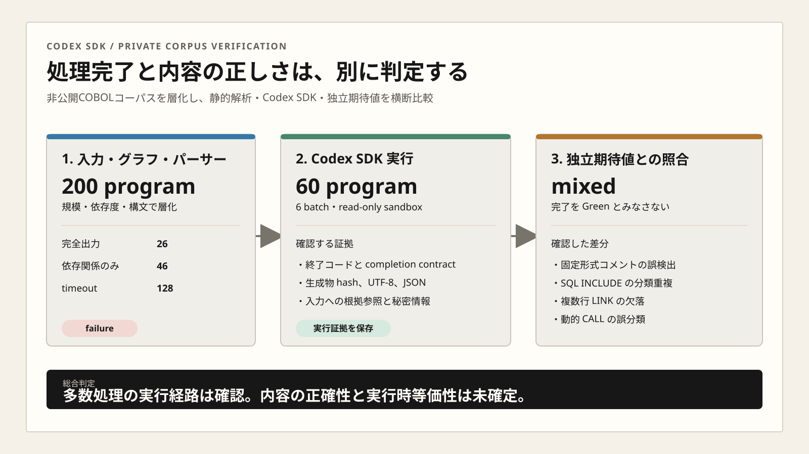

# Codex SDK 非公開COBOLコーパス多数検証報告

## 結論

ChatGPT 認証を使う Codex SDK 接続は、API キーなし・GCE・読み取り専用 sandbox の条件で、非公開COBOLコーパスから層化した60 programを処理できました。ただし、処理完了は内容の正しさを意味しません。

静的パーサーは200 programを全件試行し、完全出力26件、依存関係のみ46件、timeout 128件でした。Codex SDKの実行契約と取得証跡の整合性は`pass`でしたが、独立期待値との照合ではコメント行、SQL `INCLUDE`、複数行のCICS `LINK`、動的`CALL`に差分があります。総合判定は`mixed`です。

## 判定一覧

| 観点 | 判定 | 確認した事実 |
|---|---|---|
| 入力の層化 | 確認済み | 規模、処理形態、依存度、主要構文を使い、パーサー200件・Codex 60件を選定 |
| 静的パーサー | failure | 完全出力26件、依存関係のみ46件、timeout 128件 |
| ChatGPT認証 | 確認済み | run専用`CODEX_HOME`を使用。APIキーと既定認証を未使用 |
| Codex SDK多数実行 | 実行pass | 6 batch・60 programを試行。終了契約合格6 batch |
| 取得証跡 | pass | hash、UTF-8、JSON、秘密情報、入力参照範囲を独立再検査 |
| 依存関係の内容 | mixed | コメント誤検出、分類重複、複数行欠落、動的呼出し誤分類を確認 |
| 失敗系 | 確認済み | 7条件が契約どおり。読み取り専用書込みなし、秘密情報検出0件 |
| 実行時等価性 | 未評価 | 対象メインフレーム、DB、トランザクション、ファイル環境で未実行 |

## 固定条件

| 項目 | 固定値 |
|---|---|
| repository commit | `dffcb68ee97efc5ac3310c18f19b23631719c5b6` |
| 実行環境 | GCEの隔離run root |
| Codex接続 | ChatGPT認証済みCodex SDK、`gpt-5.6-terra` |
| sandbox | `read-only` |
| パーサー対象 | 200 program |
| Codex対象 | 60 program、10件ずつ6 batch |
| 判定原則 | 入力から作った独立期待値を使用し、多数決を正解に使わない |

## 試したこと

1. 非公開コーパスを棚卸しし、PROGRAM-ID、規模、処理形態、主要構文、依存度を集計しました。
2. 層化した200 programへ静的パーサーを試行しました。
3. その部分集合60 programを6 batchに分け、Codex SDKを読み取り専用で実行しました。
4. 入力から依存対象と物理行を決定論的に抽出し、静的グラフ、パーサー、Codex生成物と比較しました。
5. 無効入力、認証なし、無効model、書込み要求、timeoutを含む失敗系7条件を実行しました。
6. 重要対象を再実行し、出力の安定性を比較しました。

## 結果

### 静的パーサー

| 区分 | 対象 | 完全出力 | 依存関係のみ | timeout |
|---|---:|---:|---:|---:|
| 全体 | 200 | 26 | 46 | 128 |
| 大規模 | 96 | 0 | 0 | 96 |
| 中規模 | 83 | 12 | 40 | 31 |
| 小規模 | 21 | 14 | 6 | 1 |

大規模96件は全件timeoutでした。小規模の結果だけで、コーパス全体の解析成功を主張できません。

### Codex SDK

| 項目 | 結果 |
|---|---:|
| 完了batch | 6 / 6 |
| 完了program | 60 / 60 |
| completion contract合格 | 6 batch |
| 証拠integrity合格 | 6 batch |
| batch実行時間の合計 | 5,273秒（約87.9分） |
| BusinessRules | 1,572件 |
| 入力参照 | 2,633件 |
| 実在ファイル・範囲内の参照 | 2,633件 |
| 秘密情報検出 | 0件 |
| 内容判定pass | 0 batch |

### 依存関係

| 種別 | 入力 | Codex | 物理行・対象一致 | 確認した主な差分 |
|---|---:|---:|---:|---|
| `COPY` | 1,027 | 2,830 | 1,011 | コメント行の誤検出1,354件 |
| literal `CALL` | 86 | 72 | 25 | 動的呼出しの誤分類35件、反復呼出しの集約61件 |
| CICS `LINK` | 168 | 179 | 163 | コメント誤検出16件、複数行欠落5件 |
| SQL `INCLUDE` | 461 | 461 | 461 | 同じ参照を`COPY`にも分類461件 |

このほか、行番号0の`COPY`候補4件はコメントへ分類できず、入力の対応箇所も特定できませんでした。

### 再実行と失敗系

同じ重要対象を修正後ベースラインと今回条件で比較しました。依存関係の順序17件は完全一致しました。生成本文は空白正規化後もhashが異なり、業務ルール見出しは26件から25件、根拠参照行は26行から36行へ変化しました。構造依存は安定しましたが、生成本文は非決定的です。

parser結果がそれぞれ`full`、`deps-only`、`timeout`となった重要対象3件をspot checkしました。3件ともgraphは原本と完全一致し、Codex処理はcompletedでした。ただし、1件では正しいSQL `INCLUDE` 2件を`COPY`にも重複分類しました。処理系の状態が一致しても、内容判定は別に必要です。

失敗系7件はすべて契約どおりでした。無効入力を成功扱いせず、読み取り専用で書込みは発生せず、秘密情報も検出しませんでした。

## 問題記録

### 試したこと

入力の物理行を正解として、生成した依存対象、種別、行番号を比較しました。

### 結果

実行証拠は保存できましたが、内容差分が再現しました。静的パーサーは大規模入力でtimeoutが集中しました。

### 本来あるべき結果

コメントを依存へ含めず、SQL `INCLUDE`、literal `CALL`、dynamic `CALL`、CICS `LINK`を区別し、複数行と反復位置を保持する必要があります。

### 問題

- コメント中の依存表現を実依存として抽出
- SQL `INCLUDE`と`COPY`を重複計上
- 複数行のCICS `LINK`を欠落
- 動的`CALL`をliteralとして分類
- 同じliteral `CALL`の反復位置を集約
- 大規模入力で静的パーサーがtimeout
- 再実行でAI生成本文が変化

### 原因

依存抽出が固定形式コメントと継続行を十分にモデル化していません。対象名による重複排除は、同じ呼出し先の反復位置を失います。静的パーサーtimeoutの性能原因は未確認です。

### 解決案

1. 固定形式の論理文へ正規化してから依存を抽出します。
2. 依存種別、動的・静的、出現順序、物理行、論理文範囲を別fieldで保持します。
3. 今回の差分を小さな回帰fixtureへ移し、コメント、複数行、動的呼出し、反復呼出しを必須テストにします。
4. 静的パーサーへ規模別の時間・メモリ計測を追加します。

### 根拠

実行結果はhash付きmanifest、program別coverage matrix、入力から作った独立期待値で再計算しました。

### 未確認事項

- 対象メインフレーム環境での実行時等価性
- 生成した業務ルールの業務担当者レビュー
- 静的パーサーtimeoutの詳細原因
- `FeatureDescriptions`と`Features`の正式な出力契約
- AI出力の許容差分

## 公開境界

本レポートは集計値と再現可能な方法だけを記載します。顧客名、顧客repository、program名、入力path、入力hash、生成本文、認証情報は含めません。

## 後片付け

初回cleanupは、認証補助scriptに`logout`がないためrunルート削除前に停止しました。Codex CLIの`codex logout`へ切り替え、今回のcompose prefixと一致するvolumeだけを削除するよう補強しました。

run専用ChatGPT認証をlogoutし、GCEのrunルートを削除しました。既定認証は不在です。今回のcomposeラベルを持つcontainer、network、volumeはいずれも0件です。GCE VMは`RUNNING`のまま維持しています。
