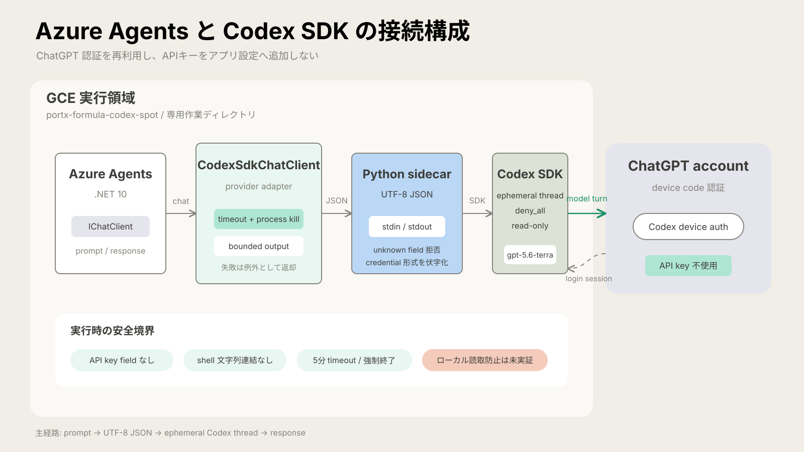

# Codex SDK GCE実行検証報告

## 結論

`Legacy-Modernization-Agents`へ追加したCodex SDK経路は、mainへのマージ後もGCEで動作しました。公開サンプル3件を処理し、Codex SDKから8回の応答を受け、リバースエンジニアリング処理は終了コード0で完了しました。

実装は[PR #1](https://github.com/portx-sora-step4/Legacy-Modernization-Agents/pull/1)でmainへマージ済みです。merge commitと検証対象のmain SHAは、どちらも`d5c6bec0789d49056460f5ea1bc9dc189a478726`です。

顧客ソースはAIへ送信していません。この報告は公開サンプルでの接続と実行を示します。顧客COBOL向けパーサーの適合、顧客ソースの抽出品質、本番運用の成立は示しません。

## 接続構成

Azure Agentsの既存`IChatClient`からPython sidecarを介してCodex SDKを呼びます。アプリ設定へOpenAI API keyを追加せず、ChatGPTで認証したCodexの資格情報を利用します。



安全境界として、承認要求を拒否する`deny_all`、一時的なthread、書込を禁止する`read-only`を既定値にしました。`full-access`と不明な入力fieldは拒否します。

## 検証条件

| 項目 | 値 |
|---|---|
| GitHub repository | `portx-sora-step4/Legacy-Modernization-Agents` |
| 検証対象 | main `d5c6bec0789d49056460f5ea1bc9dc189a478726` |
| 実行環境 | Google Compute Engine、Ubuntu 24.04 |
| .NET SDK | 10.0.400 |
| Codex SDK | Python package `openai-codex` 0.147.0 |
| model | `gpt-5.6-terra` |
| sandbox | `read-only` |
| Docker | 未使用 |
| 実行日 | 2026-09-01 JST |

入力はrepository同梱の次の公開サンプルだけです。

- `source/CUSTOMER-DATA.cpy`
- `source/CUSTOMER-DISPLAY.cbl`
- `source/CUSTOMER-INQUIRY.cbl`

## マージ前の指摘対応

CodeRabbitの初回レビューには3件の指摘がありました。現行コードへ照合し、すべて修正しました。修正後の再レビュー結果は`No actionable comments`でした。

| 対象 | 問題 | 対応 |
|---|---|---|
| `CodexSdkChatClient.GetService` | `ChatClientMetadata`を取得できない | keyなしの`ChatClientMetadata`要求へ`Metadata`を返す契約とテストを追加 |
| `README.md` | SDKが要求するPython版が不明 | Python 3.10以上を明記 |
| `codex_sdk_auth.py` | device login例外と`result.error`が伏字化されない | 例外を構造化し、tokenやAPI keyに見える値を伏字化するテストを追加 |

## 実行結果

| 観点 | 実測値 | 判定 |
|---|---:|---|
| .NET単体テスト | 145/145成功、failure 0、skip 0 | 成功 |
| Python単体テスト | 7/7成功 | 成功 |
| Codex SDK直接probe | `CODEX_SDK_OK`、status `completed` | 成功 |
| 公開入力 | 3ファイル | 対象一致 |
| リバースエンジニアリング | 終了コード0 | 完了 |
| Codex SDK応答 | 8件 | 接続成功 |
| Feature Descriptions | 5件 | 生成あり |
| Business Rules | 16件 | 生成あり |
| dependencies | 8件 | 生成あり |
| `codex_sdk_error` | 0件 | 検出なし |
| access token error | 0件 | 検出なし |
| unsupported model | 0件 | 検出なし |
| `fail:` | 0件 | 検出なし |
| secret様文字列 | 0件 | 検出なし |
| run log SHA-256 | `5da70facc5c409e74854156c66519e3e0c6ac92ab7cae76adb4c584aefb260f5` | 記録済み |

検証コマンドは次のとおりです。

```bash
dotnet test CobolToQuarkusMigration.Tests/CobolToQuarkusMigration.Tests.csproj
python -m unittest discover -s Scripts/tests -p 'test_*.py'
dotnet run --project CobolToQuarkusMigration.csproj --no-build -- \
  reverse-engineer --source "$PWD/source" \
  --output "$PWD/evidence/codex-sdk-main-d5c6bec"
```

この`--output`はGCE上の一時的な実行領域を指します。PUBLIC repoの`docs/reports/evidence/`には、生成された解析本文をコピーせず、公開可能な集計値とハッシュだけを保存します。そのため、実行時の出力先とreport内の証跡linkは意図的に異なります。

## 生成件数の差

mainマージ前の実行ではFeature Descriptions 3件、Business Rules 13件でした。mainマージ後の最終実行では5件、16件でした。入力、model、SDK応答数、依存関係数は同じですが、生成モデルの出力件数は一致しません。

この差をfailureとは判定していません。公開サンプル3件の処理、成果物生成、SDK応答8件、依存関係8件、接続エラー0件を実行契約として確認しました。一方、生成件数の完全一致を回帰Gateには使えません。業務仕様の正しさを判定するには、期待値を別の正本へ固定し、内容を評価するcheckerが必要です。

## 認証の後片付け

検証後に、実際に利用した既定の`CODEX_HOME=$HOME/.codex`をログアウトしました。

| 確認 | 結果 |
|---|---|
| `codex logout` | 終了コード0、`Successfully logged out` |
| `codex login status` | 終了コード1、`Not logged in` |
| `.codex/auth.json` | absent |

この確認はGCE内のローカル資格情報が削除されたことを示します。server側sessionの失効までは確認していません。次回の検証では、実行ごとに専用`CODEX_HOME`を作成し、同じ実行内で削除します。

## 未確認事項

- 顧客ソースでのAI抽出品質
- 固定形式、修正履歴行、CICS構文に対するパーサー適合
- `read-only`を超えたローカルファイル読取範囲の制限
- 生成されたFeature DescriptionとBusiness Ruleの業務的な正しさ
- 既存依存パッケージの脆弱性警告の解消
- 本番環境での認証、監査、保持、削除の運用

## 証跡

公開repoには、顧客情報と実行ログ本文を保存していません。再確認に必要な集計値とハッシュだけを保存します。

| 成果物 | 内容 | SHA-256 |
|---|---|---|
| [`verification-summary.txt`](evidence/codex-sdk-main-d5c6bec/verification-summary.txt) | main SHA、テスト、生成件数、エラー照合、run log hash | `52bc3735ef046737e50a7e49dc96816943ac0dcfada5e2d2dabea920e4c19a59` |
| [`direct-probe.json`](evidence/codex-sdk-main-d5c6bec/direct-probe.json) | Codex SDK直接probe | `75ca067adb8338b9041cd63182b45ca70233ecb4de45fd57c79a68b3c088f651` |
| [`source-files.txt`](evidence/codex-sdk-main-d5c6bec/source-files.txt) | 公開入力ファイル名 | `5b05a196a94d6e39a0bfe2513532c0bef29c94326c84fc0ddc432814198098f1` |
| [`reverse-engineering-exit-code.txt`](evidence/codex-sdk-main-d5c6bec/reverse-engineering-exit-code.txt) | 製品処理の終了コード | `9a271f2a916b0b6ee6cecb2426f0b3206ef074578be55d9bc94f6f3fe3ab86aa` |
| [`final-verification.txt`](evidence/codex-sdk-main-d5c6bec/final-verification.txt) | 固定件数に依存しない最終判定 | `7ff58cd4b08c966040affd37083d2c19ec45b41248aec53a4508e168da14c486` |
| [`logout-summary.txt`](evidence/codex-sdk-main-d5c6bec/logout-summary.txt) | ログアウトと資格情報削除 | `0050835dd3acd5ab5dfeb8a499047822be94ca50def4c0d77b0d140e7be17c02` |

完全なrun logはGCEの一時的な隔離領域で採取し、SHA-256だけをこのreportへ記録しました。この領域には顧客ソースを配置していません。
